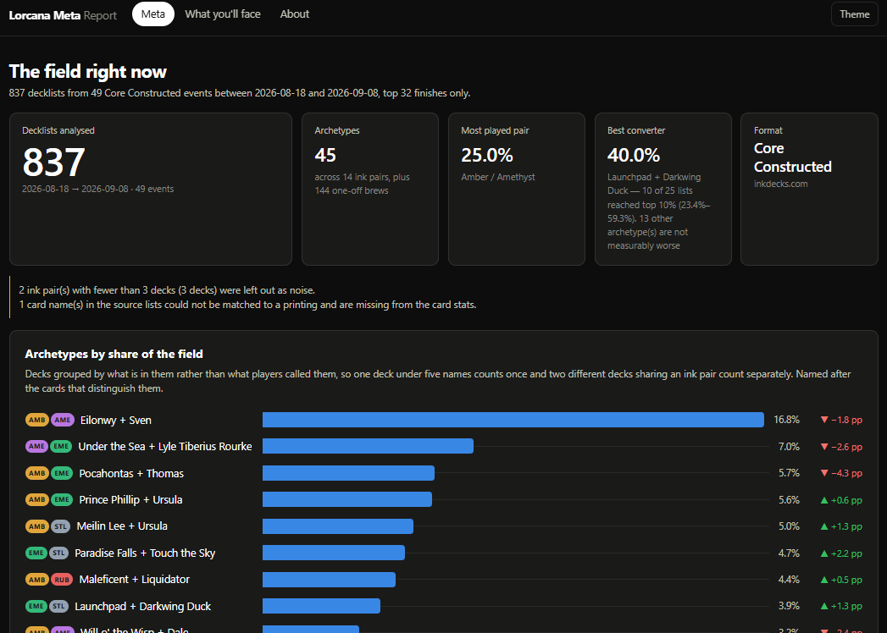
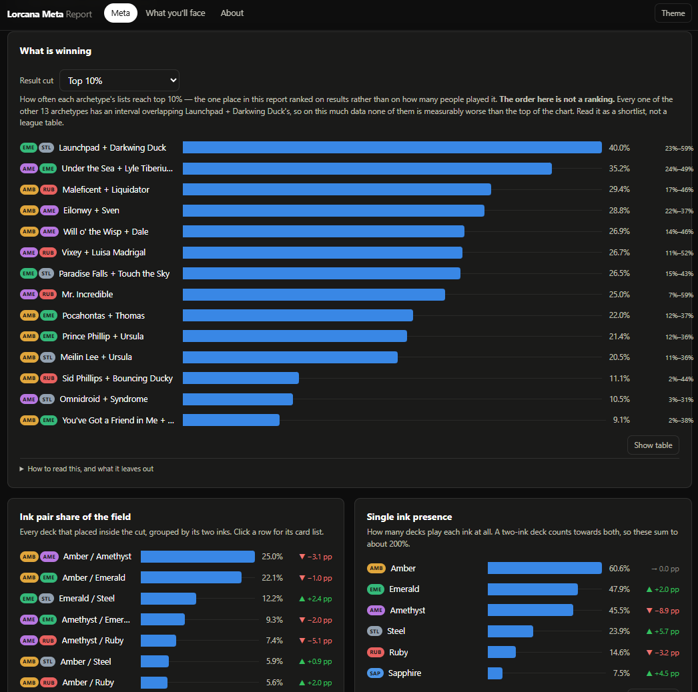
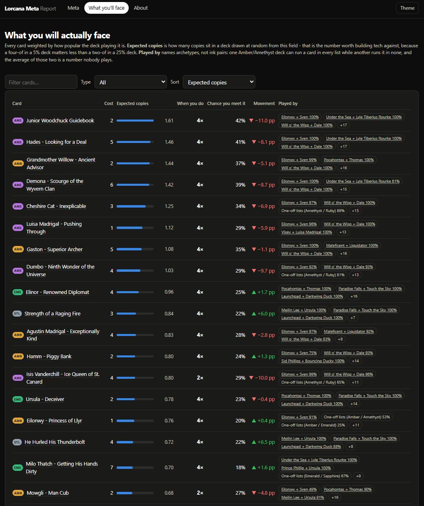

# Lorcana Meta Report

A tournament-meta report for Disney Lorcana. Pull decklists for a date window,
group them by what is actually in them, and get one HTML file that says what the field
is playing, what is winning, and what to prepare for.

<table>
  <tr>
    <td align="center"></td>
    <td align="center"></td>
    <td align="center"></td>
  </tr>
  <tr>
    <td align="center"><sub>archetypes.png</sub></td>
    <td align="center"><sub>winning.png</sub></td>
    <td align="center"><sub>what_yll_face.png</sub></td>
  </tr>
</table>

---

## What it tells you

| View | What it answers |
|---|---|
| **The field** | Which archetypes and ink pairs are being played, and how much of the field each is. |
| **What is winning** | How often each archetype's lists reach the top finishes — the one chart ranked on results rather than popularity. |
| **What you'll face** | Every card by expected copies, with the archetypes that bring it and whether the field is picking it up. |
| **Movement** | A column beside every share: what gained or lost ground between the two halves of the window. |
| **Archetype page** | Card inclusion with copy spreads, the cost curve, the cards that identify the deck, and its best finishes. |
| **About** | How every number was made, and everything the report had to drop. |

---

## Getting started

```bash
python -m venv .venv
.venv/Scripts/activate          # Windows;  source .venv/bin/activate  elsewhere
pip install -e .
```

### Try it without touching anyone's server

```bash
python tools/generate_sample_decks.py
lorcana-meta build --source local --last 40
```

Open `report.html`. No server, no hosting, nothing leaves your machine. The sample
field uses real card names but invented decks, players and events, and the report says
so on its own front page.

### Build from inkdecks

Their terms require written permission for automated access, and the flag is you
stating you have it — see [Data sources](#data-sources).

```bash
$env:INKDECKS_CONSENT = "1"                                              # this window
[Environment]::SetEnvironmentVariable("INKDECKS_CONSENT", "1", "User")   # and future ones

lorcana-meta build --last 14 --top 32 --min-players 32
```

### How long the first build takes

Their rate limit, not politeness for its own sake — measured at roughly **4–9 deck
pages a minute**.

| Window | Decks | First build |
|---|---|---|
| 14 days, top 8 | ~80 | ~20 min |
| 14 days, top 32 | ~370 | ~1.5 h |
| 30 days, top 32 | ~800 | ~3.5 h |

**Every build after that is seconds.** Decklists never change once published, so they
are cached forever and a rebuild fetches only what is new. A long first build does not
have to happen in one sitting: decks are fetched best-placed first, so Ctrl+C and the
same command tomorrow resumes where it stopped, and a partial field says so.

---

## Command line

```
lorcana-meta build [options]
```

| Option | Default | What it does |
|---|---|---|
| `--source {inkdecks,local}` | `inkdecks` | Where decklists come from. |
| `--last N` | `30` | Days back from today. |
| `--start` / `--end` | – | Explicit window, `YYYY-MM-DD`. Overrides `--last`. |
| `--top N` | `32` | Keep finishes this high or better. `0` keeps everything. |
| `--min-players N` | – | Ignore smaller events. For inkdecks it filters on the listing row, so those deck pages are never requested. Decks whose event size is unknown are kept. |
| `--min-pair-decks N` | `3` | Drop ink pairs thinner than this as noise. The count is still reported. |
| `--cluster-threshold F` | `0.60` | Card overlap that counts as the same archetype. Lower merges more, higher splits more. |
| `--out` | `site/data/meta.json` | Where the data goes. |
| `--no-bundle` | – | Skip writing `report.html`. |
| `--bundle-out` | `report.html` | Where the single file goes. |
| `--refresh-cards` | – | Re-download the card database instead of using the 24h cache. |
| `--indent N` | – | Pretty-print the JSON. |

inkdecks only:

| Option | Default | What it does |
|---|---|---|
| `--inkdecks-category` | `core` | Which tab to read: `core`, `infinity`, `poorcana`, `all`. This selects the format for this source, not `--format`. |
| `--inkdecks-consent` | – | Confirm you have their written permission. Required. |
| `--inkdecks-delay F` | `3.0` | Seconds between requests. Grows on a 429, never shrinks within a run. |
| `--inkdecks-max-decks N` | `1500` | Stop after this many decks, best-placed first. |

local only: `--local-dir` (default `data/decks`) and `--format` (default
`Core Constructed`, for decks that carry no format of their own).

---

## Data sources

**inkdecks.com** (`--source inkdecks`, default) has by far the widest coverage of
Lorcana tournaments. Their [terms of use](https://inkdecks.com/pages/terms) prohibit
automated access:

> You may not use automated systems (e.g., bots, scrapers, spiders) to access,
> extract, copy, or collect data from the Website without prior written consent.

So the source refuses to run until you confirm you have that consent. The permission
this is written around is **personal use with no commercialised public site**, so the
source sets `publishable = False`, which travels into the report and makes
`tests/check_report.py` fail — anything that publishes has to be told to ignore a
failing check first. If your own permission differs, changing that is a deliberate
edit, not a default to drift into.

The crawl is one request at a time with an adaptive delay, deck pages cached forever,
and a session that is read-only by construction.

**Card data:** [lorcana-api.com](https://lorcana-api.com/) — free, no key. One bulk
endpoint cached for 24 hours, supplying card text, cost, inks, type and images.

**Your own files** (`--source local`) read `data/decks/*.{json,txt}` — good for local
events no platform covers, and for lists copied by hand. Format:
[`data/decks/README.md`](data/decks/README.md). `tools/import_pasted_decks.py` converts
a file of pasted lists; reading a page and copying a list yourself is not automated
access, and the tool fetches nothing.

---

## Tests

No dependencies, no network, no permissions:

```bash
python tests/test_pipeline.py        # parsing, inks, aggregation, movement, result cuts
python tests/test_cluster.py         # archetype detection
python tests/test_local_source.py    # decks off disk, paste importer
python tests/test_inkdecks.py        # parsers, consent, throttle, lock
python tests/test_report_shape.py    # report and page agree on their shape
python tests/test_bundle.py          # the single file stays self-contained
python tests/check_report.py         # a built report is sane (needs a build first)
node   tests/test_render.mjs         # every page renders (needs a build first)
```

CI runs all of them on Ubuntu **and** Windows, plus an end-to-end build, `ruff check`,
and one job with a legacy Windows code page. Four exist because of failures that are
silent by nature:

- `test_report_shape.py` — a field the build stops emitting renders as a blank cell,
  not an error; and nothing may ship in the JSON that nothing reads, since the whole
  file goes to the browser.
- `test_render.mjs` — the page throwing during render leaves a blank screen with no
  clue on it.
- `test_bundle.py` — a bundle that stops being self-contained still opens, and just
  shows "could not load data/meta.json".
- `check_report.py` — it reconciles the arithmetic a reader might redo, and it is the
  gate that keeps privately-licensed data from being published.

`tests/test_inkdecks.py --live` additionally hits the real site and needs consent; it
never runs in CI.

---

## Layout

| Path | What it is |
|---|---|
| `report.html` | The report. Open this. |
| `site/data/meta.json` | The data behind it. Records the version, commit and dirty flag of the build that made it. |
| `site/` | The page: one HTML file, one stylesheet, one script, no build step. |
| `src/lorcana_meta/` | `sources/` fetch decklists, `cards.py` resolves names, `cluster.py` finds archetypes, `analyze.py` does the maths, `bundle.py` writes the single file, `cli.py` wires it together. |
| `.cache/` | Cached deck pages, the learned request rate, the card database. Safe to delete. |
| `MAINTAINING.md` | Commands, hard rules, platform traps, and the additions that were measured and rejected. |

A new source is one file in `src/lorcana_meta/sources/`: implement
`fetch(start, end) -> list[Deck]`, expose `name` / `attribution` / `attribution_url` /
`publishable`, register it. Nothing downstream changes.

---

## Licence

Personal project, no licence granted. Disney Lorcana is a trademark of Disney and
Ravensburger; this is an unofficial fan tool, not published, endorsed or approved by
either. Decklist data belongs to its sources under their own terms.
